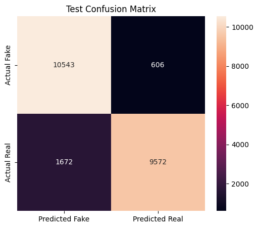

# DeepShield

<p align="center">
  
</p>

<p align="center">
  <strong>Platform Deteksi Deepfake Berbasis AI</strong>
</p>

<p align="center">
  Mendeteksi keaslian gambar wajah menggunakan teknologi Deep Learning.
</p>

---

## Daftar Isi

* [Tentang Proyek](#tentang-proyek)
* [Fitur Utama](#fitur-utama)
* [Tangkapan Layar](#tangkapan-layar)
* [Teknologi yang Digunakan](#teknologi-yang-digunakan)
* [Arsitektur Sistem](#arsitektur-sistem)
* [Performa Model AI](#performa-model-ai)
* [Panduan Instalasi](#panduan-instalasi)
* [Model AI](#model-ai)
* [Kontributor](#kontributor)
* [Lisensi](#lisensi)

---

## Tentang Proyek

**DeepShield** adalah aplikasi web berbasis kecerdasan buatan (Artificial Intelligence) yang dirancang untuk mendeteksi keaslian gambar wajah dan mengklasifikasikannya ke dalam dua kategori, yaitu **Real** dan **Fake (Deepfake)**.

Sistem mendukung unggahan gambar dalam format **JPG**, **PNG**, dan **WEBP**, serta memberikan informasi berupa:

* Hasil klasifikasi gambar
* Nilai confidence score
* Penjelasan hasil deteksi menggunakan Generative AI
* Riwayat hasil pemindaian
* Laporan hasil deteksi dalam format PDF

Proyek ini dikembangkan sebagai bagian dari **Capstone Project Coding Camp Powered by DBS Foundation 2026**.

DeepShield bertujuan untuk meningkatkan kewaspadaan terhadap manipulasi gambar digital sekaligus membantu proses verifikasi awal terhadap konten visual yang berpotensi menyesatkan di era digital.

---

## Fitur Utama

* Registrasi dan Login Pengguna
* Autentikasi Menggunakan JWT
* Unggah Gambar Wajah
* Deteksi Deepfake Berbasis Deep Learning
* Prediksi Confidence Score
* Penjelasan Hasil Menggunakan Generative AI
* Riwayat Hasil Deteksi
* Unduh Laporan PDF
* Integrasi REST API

---

## Tangkapan Layar

<table>
<tr>
<td align="center">
<br>
<b>Halaman Login</b>
</td>

<td align="center">
<br>
<b>Halaman Deteksi</b>
</td>

<td align="center">
<br>
<b>Hasil Deteksi</b>
</td>

<td align="center">
<br>
<b>Riwayat Deteksi</b>
</td>
</tr>
</table>

---

## Teknologi yang Digunakan

| Komponen      | Teknologi                              |
| ------------- | -------------------------------------- |
| Frontend      | React.js, Vite, React Router DOM, CSS3 |
| Backend       | Node.js, Express.js                    |
| Database      | MySQL                                  |
| Autentikasi   | JWT Authentication                     |
| Layanan AI    | FastAPI, TensorFlow/Keras              |
| Generative AI | Groq API                               |
| Web Server AI | Uvicorn                                |

---

## Arsitektur Sistem

```
┌─────────┐
│  User   │
└────┬────┘
     │
     ▼
┌─────────────────┐
│ Frontend        │
│ React + Vite    │
└────┬────────────┘
     │ HTTP Request
     ▼
┌─────────────────┐
│ Backend         │
│ Express.js      │
└────┬───────┬────┘
     │       │
     │       └────────► MySQL Database
     │
     ▼
┌─────────────────┐
│ AI Service      │
│ FastAPI         │
└────┬────────────┘
     │
     ├────────► TensorFlow Model
     │
     └────────► Groq API
```

---

## Performa Model AI

| Metrik             | Nilai  |
| ------------------ | ------ |
| Accuracy | 89.83% |
| Weighted Precision | 90.20% |
| Weighted Recall | 89.83% |
| Weighted F1-Score | 89.81% |

### Confusion Matrix

<br>

---

## Panduan Instalasi

### Prasyarat

#### Umum

* Git

#### Fullstack

* Node.js
* npm
* MySQL

#### Layanan AI

* Python 3.10 atau lebih baru
* API Key Groq

---

### 1. Clone Repository

```bash
git clone https://github.com/PeterTaniwan/DeepShield-DeepFake-Image-Detection-Capstone-Project-Coding-Camp-2026.git

cd DeepShield-DeepFake-Image-Detection-Capstone-Project-Coding-Camp-2026
```

---

### 2. Menjalankan Frontend

```bash
cd Frontend_Project

npm install

npm run dev
```

Frontend akan berjalan pada:

```text
http://localhost:5173
```

---

### 3. Menjalankan Backend

Buat file `.env`:

```env
PORT=3000
NODE_ENV=development

DB_HOST=localhost
DB_PORT=3306
DB_USER=root
DB_PASSWORD=
DB_NAME=deepshield_db

JWT_SECRET=your_secret_key
JWT_EXPIRES_IN=24h

AI_SERVER_URL=http://localhost:8000
```

Install dependency dan inisialisasi database:

```bash
cd Backend_Project

npm install

npm run db:init

npm run dev
```

Backend akan berjalan pada:

```text
http://localhost:3000
```

---

### 4. Menjalankan Layanan AI

Buat virtual environment:

```bash
cd AI_Project

python -m venv venv
```

Aktivasi virtual environment:

Linux / macOS

```bash
source venv/bin/activate
```

Windows

```bash
venv\Scripts\activate
```

Install dependency:

```bash
pip install -r requirements.txt
```

Buat file `.env`:

```env
GROQ_API_KEY=your_groq_api_key
```

Jalankan server AI:

```bash
uvicorn main:app --reload
```

Dokumentasi API (Swagger):

```text
http://127.0.0.1:8000/docs
```

---

## Model AI

Model AI yang digunakan pada proyek ini dapat diakses melalui tautan berikut:

[Klik disini](https://drive.google.com/drive/folders/1YA2MoSPg-_4BGVoz4xXGEhNz4qMhMn_K)

---

## Kontributor

### Tim Capstone Coding Camp 2026 — CC26-PSU284

| ID Peserta     | Nama                     | Peran                    |
| -------------- | ------------------------ | ------------------------ |
| CDCC011D6Y2148 | Peter Taniwan            | Data Scientist           |
| CDCC011D6Y1780 | Raymond Emmanuel Krista  | Data Scientist           |
| CACC011D6X0900 | Rahma Aulia Putri        | AI Engineer              |
| CACC299D6Y1743 | Crist Evan Lamhot Turnip | AI Engineer              |
| CFCC525D6Y0177 | Samuel Rivaldo Saragih   | Full Stack Web Developer |
| CFCC011D6X2041 | Mona Yola Lumban Raja    | Full Stack Web Developer |

---

## Lisensi

Proyek ini dikembangkan untuk keperluan pendidikan dan penelitian sebagai bagian dari Capstone Project Coding Camp Powered by DBS Foundation 2026.
