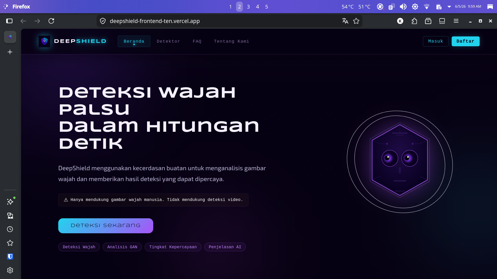
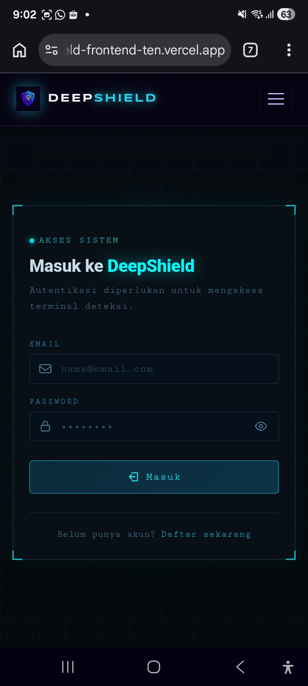
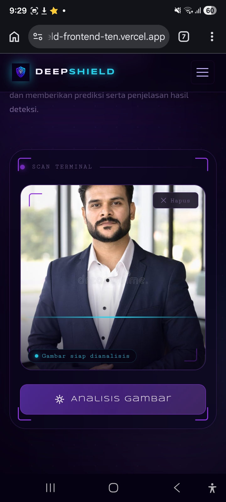
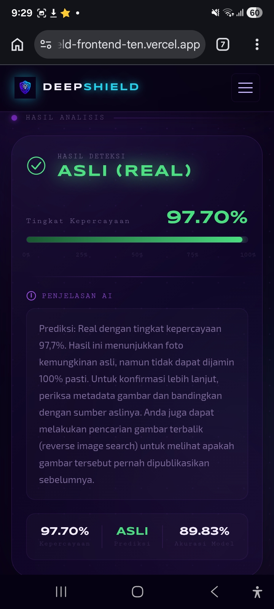
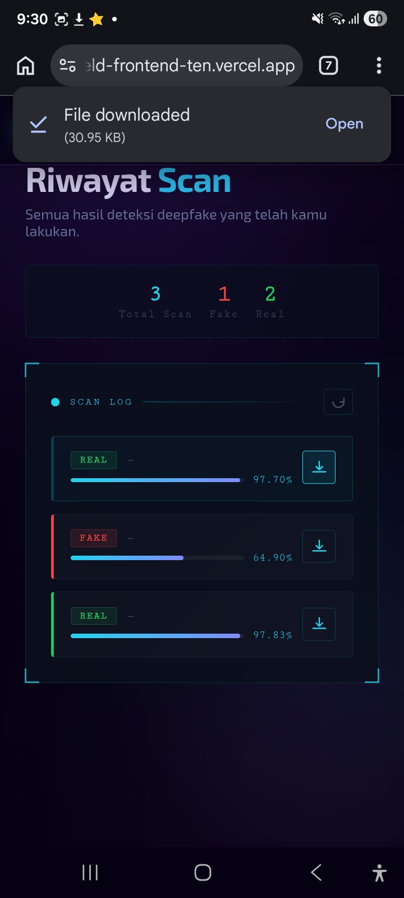

# DeepShield



## Tentang Proyek
**DeepShield** adalah aplikasi web berbasis AI yang dirancang untuk mendeteksi keaslian gambar wajah dan mengklasifikasikannya ke dalam dua kategori: **Real** atau **Fake**. Sistem mendukung unggahan gambar dalam format **JPG**, **PNG**, dan **WEBP**, serta menghasilkan informasi berupa **hasil prediksi**, **tingkat kepercayaan (confidence score)**, dan **penjelasan singkat** yang dihasilkan oleh model **Generative AI** untuk membantu pengguna memahami hasil analisis.

Proyek ini dikembangkan sebagai bagian dari **Capstone Project Coding Camp Powered by DBS Foundation 2026**. DeepShield bertujuan untuk meningkatkan kewaspadaan terhadap potensi manipulasi gambar digital, sekaligus mendukung media, komunitas, dan layanan publik sebagai mekanisme verifikasi awal dalam menghadapi penyebaran informasi yang tidak valid di era digital.

## Screenshot
<p align="start">
  &nbsp;&nbsp;
  &nbsp;&nbsp;
  &nbsp;&nbsp;
  &nbsp;&nbsp;
</p>

## Fitur Utama
- Login dan Register User
- Upload Gambar Wajah
- Deteksi Deepfake Berbasis AI
- Riwayat Hasil Scan
- Download Laporan PDF
- JWT Authentication
- RESTful API

## Tech Stack
Frontend:
- React.js
- Vite
- React Router DOM
- CSS3

Backend:
- Node.js
- Express.js
- JWT Authentication
- Multer
- MySQL

AI:
- FastAPI
- TensorFlow/Keras
- Groq API
- Uvicorn

## Cara Menjalankan Proyek

### Prasyarat
- [git](https://git-scm.com/install/)

Fullstack:
- [npm](https://nodejs.org/en/download)
- [MySQL](https://www.mysql.com/downloads/)

AI:
- [Python](https://www.python.org/downloads/) 3.10+
- API Key dari [Groq](https://console.groq.com) untuk generative AI

### 1. Clone Repositori

```bash
git clone https://github.com/PeterTaniwan/DeepShield-DeepFake-Image-Detection-Capstone-Project-Coding-Camp-2026.git
cd DeepShield-DeepFake-Image-Detection-Capstone-Project-Coding-Camp-2026
```

### 2. Konfigurasi Frontend

```bash
# 1. Pindah ke direktori proyek
cd ../Frontend_Project

# 2. Instalasi
npm install

# 3. Jalankan server
npm run dev
```

### 3. Konfigurasi Backend

```bash
# 1. Pindah ke direktori proyek
cd ../Backend_Project

# 2. Setup environment variabel
# Buat file .env secara manual
# Edit file .env dan isi:
# PORT=3000
# NODE_ENV=development
# DB_HOST=localhost
# DB_PORT=3306
# DB_USER=root
# DB_PASSWORD=
# DB_NAME=deepshield_db
# JWT_SECRET=<JWT_SECRET>
# JWT_EXPIRES_IN=24h
# AI_SERVER_URL=<API_MODEL_AI>

# 3. Jalankan perintah berikut
npm install        # instalasi
npm run db:init    # buat database + tabel + user demo
npm run dev        # jalankan server
```

### 4. Konfigurasi Model AI

```bash
# 1. Pindah ke direktori proyek
cd ../AI_Project

# 2. Setup virtual environment
python3 -m venv venv        # Windows: py -m venv venv
source venv/bin/activate    # Windows: venv\Scripts\activate

# 3. Install dependencies
pip install -r requirements.txt

# 4. Setup environment variabel
# Buat file .env secara manual
# Edit file .env dan isi:
# GROQ_API_KEY=<API_KEY_DARI_console.groq.com>

# 5. Run AI model server
uvicorn main:app # default port: 8000
# uvicorn main:app --reload (restart otomatis saat ada perubahan)
# uvicorn main:app --host 127.0.0.1 --port 5000 (menentukan host dan port custom)

# 6. Testing (opsional)
# Akses API Documentation (Swagger UI)
http://127.0.0.1:8000/docs # atau http://localhost:8000/docs
```

## Kontributor
Coding Camp Capstone Team	CC26-PSU284
- CDCC011D6Y2148 - Peter Taniwan - Data Scientist
- CDCC011D6Y1780 - Raymond Emmanuel Krista - Data Scientist
- CACC011D6X0900 - Rahma Aulia Putri - AI Engineer
- CACC299D6Y1743 - Crist Evan Lamhot Turnip - AI Engineer
- CFCC525D6Y0177 - Samuel Rivaldo Saragih - Full Stack Web Developer
- CFCC011D6X2041 - Mona Yola Lumban Raja - Full Stack Web Developer
